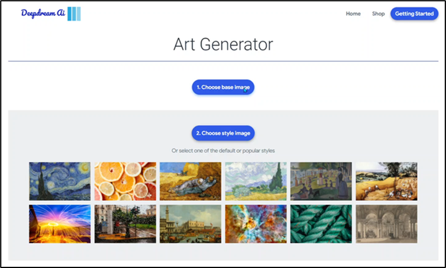
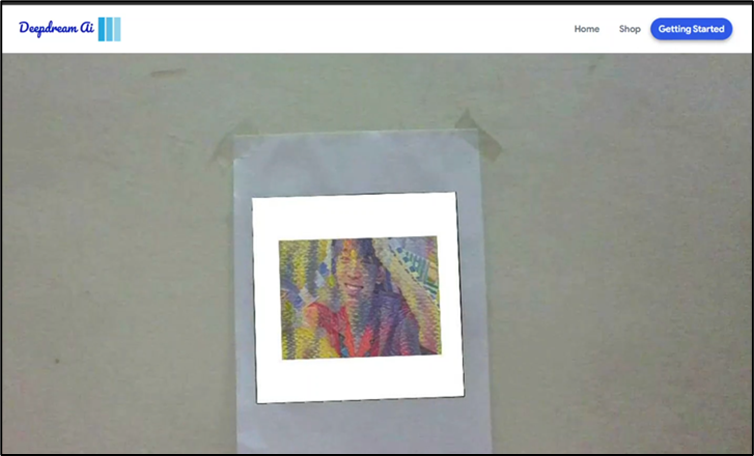
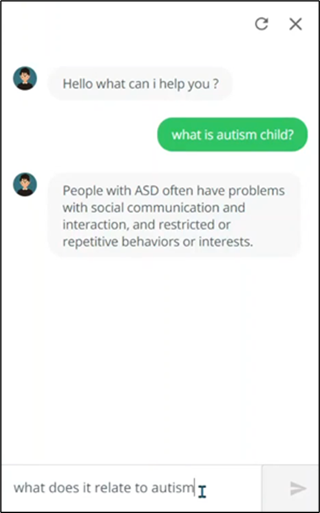
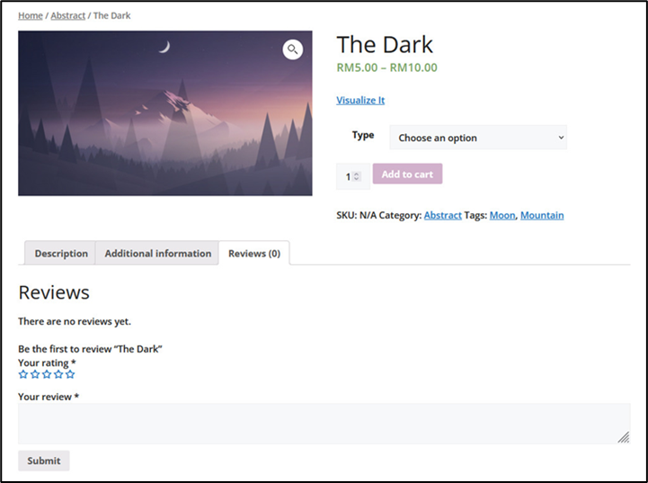

# Deepdream-AI

The autism community has shown their unique arts by using various techniques and materials on the canvas. Perception of the normal people is always downgrading autism arts because they feel like the autism arts have no value of artistic. The interpretation arts of normal people and autism people is really different; thus, the normal people couldn’t understand the story behind the autism arts. Hence, we as a student of Artificial Intelligence have come out one solution for helping this community by build this web application to increase their value of unique art works and at the same time spread about autism community to the normal community

## Problems
 - Loss of special talent for young adult with Autism Spectrum Disorder (ASD) due to lack of encouragement, support and hope. 
 - Impairment in social function led to young adult with Autism Spectrum Disorder (ASD) led to difficulties in working space. 
 - Highest unemployment rate for young adult with Autism Spectrum Disorder (ASD) in developed countries.

 ## Module 
 |Module | Fucntion|
 |--|--|
 |Art Generator |A model that utilises Artificial Intelligence technique, which is Convolutional Neural Network (CNN) to blend the style image with base image to generate new output image. |
|Marketplace| Act as a platform which allow users to publish the artworks and exchange their opinion about artworks|
|Chatbot | Users can seek for help if they face difficulty in using the web application faster, and not wasting their time to wait customer service staffs to handle them.|
|Art Visualiser | Allowed user to map the artwork with frame to real world place through the lens of camera|

## Significance
1.	Social – This project able to promote art generate by autism people which let other people to undertstand their feeling and emotions. In addition, the autism have a occuption in the society which prevent autsim people from sosial disconnection.
2.	Finance – The generated art may be publish in marketplace and generate fund for autism people. This is a sustainable way for autism peoples to support their daily life by themself
3.	Effectiveness – The Ai algorithm is more effective and efficient in learning the art style of autism people and generate art compare to do it manually. The art is acccesable on internet which make it protable.

## User Interface
Art Generator\


Art Visualizer\


Chatbot\


Marketplace\


## Installation
1. Install Tensorflow using this guide (https://www.tensorflow.org/install/pip)
2. Install other required dependency with this command
```
pip3 install -r requirements.txt
```
3. Run the application using
```
python3 app.py
```

## Reference
- Gatys, L. A., Ecker, A. S., & Bethge, M. (2015). A neural algorithm of artistic style. arXiv preprint arXiv:1508.06576.